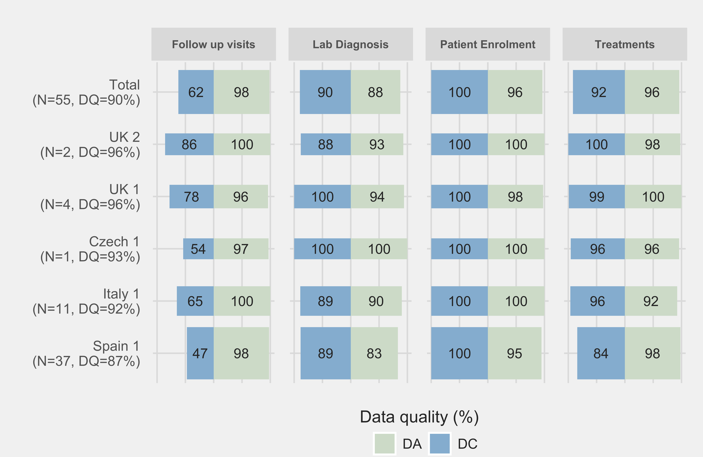

# IEEE Healthcom 2017 scipt

URL : [URL](https://ieeexplore.ieee.org/abstract/document/8210764/)
URL 2 webpage : [URL](https://stephang.netlify.com/publication/ieee-inpdr/)

Pictures:

NPB Data Quality Evaluation by center. The height of each bar represents the relative number of entered NPB records (n.a. on ‘Total’).

NPC Data Quality Evaluation by center. The height of each bar represents the relative number of entered NPC records (n.a. on ‘Total’).

User sessions & Session times of INPDR users